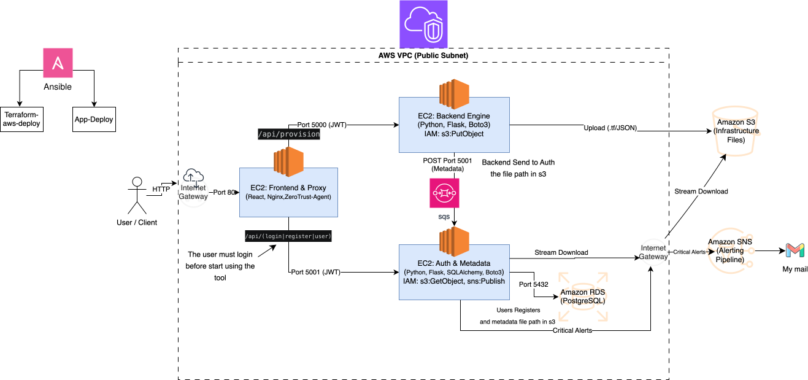

# ☁️ Cloud Infrastructure Provisioning System

This repository contains the architecture and codebase for a custom infrastructure provisioning platform. The system lets authenticated users generate, store, and retrieve Terraform (`.tf`) and JSON configuration files through a web interface.

## 🏗️ Architecture Overview

The environment runs on AWS inside a custom VPC, using a public subnet and an Internet Gateway and Route Table for external routing. I built the platform using a microservices approach distributed across three dedicated EC2 instances:

**1. Frontend (React + Nginx)**
* Enforces strict HTTPS encryption using a Cloudflare-provisioned SSL certificate.
* Nginx acts as an internal reverse proxy, taking the clean traffic from Cloudflare and routing API calls to the correct backend server based on the URL path.

**2. Provisioning Backend (Python + Flask + Boto3)**
* Takes the user's infrastructure requirements and validates the input.
* Compiles the actual `.tf` or `.json` files.
* Uploads the generated files directly to an Amazon S3 bucket.
* Sends an internal POST request to the Auth server to log the new file's S3 path.

**3. Auth & Metadata Service (Python + Flask + SQLAlchemy + Boto3)**
* Handles user sign-ups and JWT-based logins.
* Connects to an Amazon RDS (PostgreSQL) database to store user profiles and file metadata.
* Uses Boto3 to fetch the raw file content directly from S3 when a user wants to view or download their past work.
* Triggers critical error alerts to an administrator email list via AWS SNS.
---

## 🏗️ Deployment Architecture

This project features a fully automated, zero-touch deployment pipeline. It bridges **Infrastructure as Code (IaC)** with **Configuration Management** to ensure a seamless transition from bare-metal cloud resources to a fully running application.

### How It Works Behind the Scenes

The deployment process is orchestrated in a single, continuous workflow, divided into three main logical phases:

1. **Infrastructure Provisioning (Terraform)**
   The pipeline begins by interacting with AWS to provision the foundational infrastructure. Terraform spins up the necessary EC2 instances (for the Frontend, Backend, and Auth services), alongside managed services like RDS, S3, SQS, and SNS. Once complete, it outputs the newly generated data, such as public/private IPs and database endpoints.

2. **Dynamic In-Memory Inventory (Ansible)**
   To bridge the gap between dynamic cloud infrastructure and configuration management, this project completely eliminates static `hosts` files. Instead, Ansible captures Terraform's real-time outputs and uses the `add_host` module to construct a "virtual inventory" directly in its memory. This makes the newly created AWS servers instantly accessible for configuration.

3. **Secure Configuration & Application Deployment (Ansible)**
   With the virtual inventory established, Ansible connects to the fresh EC2 instances via SSH. It intelligently routes the dynamic AWS variables (e.g., the RDS endpoint or the Auth service's private IP) and combines them with encrypted secrets decrypted on-the-fly via **Ansible Vault**. It generates highly accurate `.env` files directly on the servers, installs dependencies, and finally spins up the application services.

This architecture ensures that the Terraform state remains the single source of truth, completely eliminating manual IP tracking, hardcoded values, and human configuration errors.

## 🌩️ AWS Services Used

| Service | Purpose |
| :--- | :--- |
| **S3** 🪣 | Object storage for the generated configuration files. |
| **RDS** 🗄️ | Managed PostgreSQL database for user credentials and file paths. |
| **SQS** 📮 | Fully managed message queuing service to decouple microservices and process asynchronous background tasks reliably.(Backend to Auth) |
| **SNS** 📨 | Push notifications for critical system errors (routes directly to email). |

---

## 🛡️ Security Posture

I locked down the environment using strict networking rules and identity management to avoid relying on hardcoded credentials.

**Security Groups**
* **Frontend:** Inbound HTTP (`80`) and HTTPS (`443`) traffic is strictly limited to Cloudflare's verified IP ranges. Direct public access to the EC2 instance is denied, guaranteeing that all requests are inspected by the Cloudflare WAF and Zero Trust policies before reaching Nginx.
* **Provisioning:** Accepts inbound traffic on port `5000` from the Frontend's SG. It also initiates connections to the Auth server on port `5001` for internal data sync.
* **Auth:** Only accepts traffic on port `5001` from the Frontend and Provisioning servers' SGs.
* **RDS:** Restricted to port `5432`, allowing connections exclusively from the Auth server.

**IAM Roles**
The backend EC2 instances use attached IAM roles instead of access keys, adhering to the principle of least privilege:
* **Provisioning (Backend):** Has an IAM policy allowing `s3:PutObject` for the specific configuration bucket, and `sqs:SendMessage` to securely push background tasks into the message queue.
* **Auth:** Has an IAM policy allowing `s3:GetObject` to read from the bucket, `sqs:ReceiveMessage` and `sqs:DeleteMessage` to consume and process tasks from the queue, and `sns:Publish` to trigger email alerts for critical system events.

---

## 🔄 How It Works

**Generating a File**
User clicks 'Create' ➡️ React App ➡️ Nginx ➡️ Provisioning EC2 ➡️ Uploads to S3 ➡️ Notifies Auth EC2 ➡️ Saves metadata in RDS.

**Retrieving a File**
User clicks 'View' ➡️ React App ➡️ Auth EC2 ➡️ Looks up path in RDS ➡️ Pulls content from S3 ➡️ Returns to UI.

**System Alerts**
Auth EC2 catches an exception (e.g., DB down) ➡️ Triggers SNS Topic ➡️ Sends email alert to admins.

## Architecture Diagram
